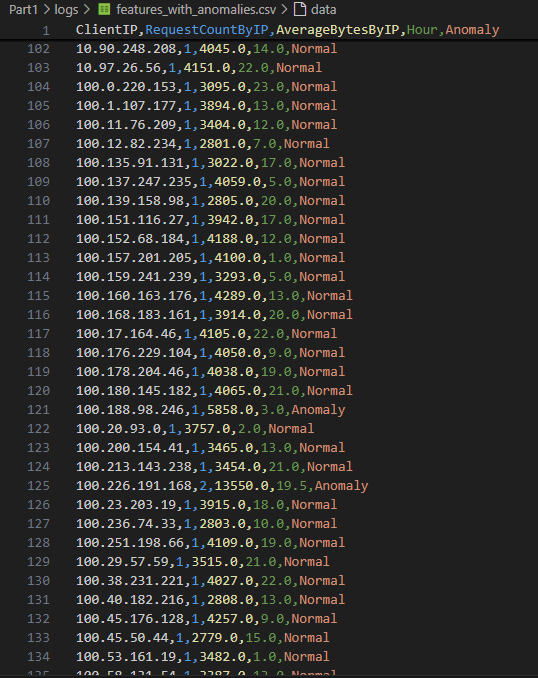
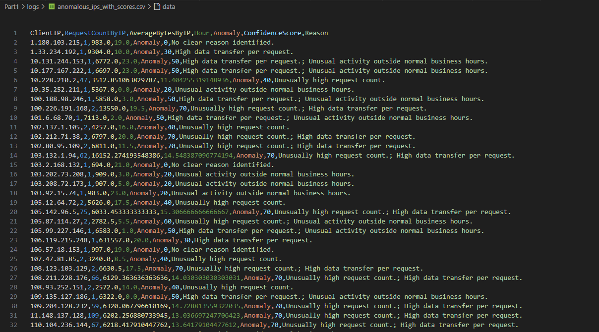
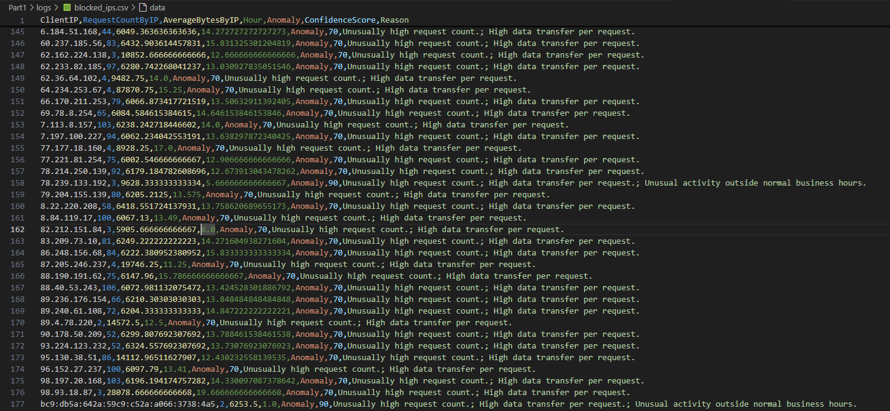

# Cybersecurity Problem Solver Challenge


## Introduction

First and foremost, I would like to express my gratitude for the opportunity to join this team. Working on this project has been an exciting challenge that kept me engaged even beyond the initial analysis. After completing the required tasks, I decided to take the project a step further by implementing a more robust solution. As a result, the work is divided into two segments: Part 1, which addresses the original requirements of the challenge, and Part 2, which focuses on scalability and future-proofing, as detailed in this README.

This project is a cybersecurity challenge aimed at detecting and analyzing anomalies in network traffic data. Its objective is to leverage machine learning and data visualization techniques to identify potential security risks, propose mitigation strategies, and communicate findings effectively through clear visualizations and comprehensive documentation.

---

## Objective

The main objectives of the project include:

1. **Data Analysis**: Extract insights from network traffic logs to identify patterns, anomalies, and potential security threats.
2. **Anomaly Detection**: Use machine learning models to detect unusual behaviors in network traffic.
3. **Visualization**: Create visual tools for better understanding traffic patterns and anomalies.
4. **Automation**: Build a robust pipeline to process network logs and generate insights dynamically.
5. **Mitigation**: Simulate security policies to mitigate risks, such as blocking malicious IPs.
6. **Scalability**: Ensure the solution is scalable to handle dynamic and large datasets.

---

## Part 1: Core Solution

### Introduction

This project tackles the challenge of identifying anomalies within network traffic data, a critical task in cybersecurity. Initially, the task seemed straightforward due to visible discrepancies in the data. However, further exploration revealed an opportunity to design a robust, scalable solution.

Leveraging Python and machine learning techniques, the project includes:

1. **Data Analysis**: Comprehensive analysis of network traffic logs to uncover patterns and irregularities.
2. **Anomaly Detection**: Implementation of an Isolation Forest model to classify traffic as normal or anomalous.
3. **Risk Mitigation**: Providing actionable insights and reasoning for detected anomalies.
4. **Visualization**: Detailed graphs to highlight anomalies, trends, and insights from the network data.

### Objective

This solution is part of a cybersecurity assessment to evaluate data analysis capabilities, logical reasoning, and the development of a mitigation policy to address security risks. It fulfills the following requirements:
- Analyzing network traffic to identify patterns and threats.
- Developing and implementing a security policy to mitigate risks.
- Providing clear, innovative, and actionable insights through visualization and documentation.

By integrating machine learning with thoughtful analysis, this project aims to go beyond traditional anomaly detection to enhance network security strategies.

---

## Code Explanation

### 1. Folder Initialization
Ensures that folders for saving logs and graphs exist, providing a structured way to store results and visualizations:
```python
LOGS_FOLDER = 'logs'
GRAPHS_FOLDER = 'graphs'
os.makedirs(LOGS_FOLDER, exist_ok=True)
os.makedirs(GRAPHS_FOLDER, exist_ok=True)
```

### 2. Loading Data
Loads the dataset and preprocesses timestamps for time-based feature extraction:
```python
def load_data(file_path):
    ...
```

### 3. Feature Engineering
Aggregates raw network data to create meaningful features like request count, average data transferred, and active hours:
```python
def feature_engineering(data):
    ...
```

### 4. Anomaly Detection
Uses the Isolation Forest model to detect anomalies:
```python
def detect_anomalies(features, contamination=0.05):
    ...
```
- **Why Isolation Forest?**: It isolates anomalies by random partitioning and is effective for high-dimensional and unsupervised tasks.

### 5. Confidence Scoring
Assigns confidence scores to anomalies based on severity indicators like high request count, data transfer, and off-hour activity:
```python
def calculate_confidence_score(row, features):
    ...
```

### 6. Assigning Anomaly Reasons
Explains why specific behaviors were flagged as anomalous:
```python
def assign_anomaly_reasons(anomalous_ips, features):
    ...
```

### 7. Visualization
Generates visualizations like scatter plots, time series, bar charts, heatmaps, and pie charts to provide insights:
```python
def visualize_anomalies(features):
    ...
```

### 8. Main Execution
Executes the entire pipeline from loading data to saving results:
```python
if __name__ == "__main__":
    ...
```

---

## Security Policies Considered

1. **Thresholds for Anomalies**:
   - Request counts above the 95th percentile.
   - Average bytes per request above the 95th percentile.
   - Activities during non-business hours.

2. **Mitigation Suggestions**:
   - Automatic Blocking: If an IP's confidence score reaches or exceeds a threshold of 70, it is automatically added to the blocking policy.
   - Block IPs exhibiting consistent anomalous behavior.
   - Rate-limit requests from flagged IPs.
   - Notify security teams for manual investigation.

---

## Risk Assessment

1. **Identified Risks**:
   - **Denial-of-Service (DoS)**: High request counts indicate potential DoS attacks.
   - **Data Exfiltration**: High average bytes suggest possible data leakage.
   - **Unauthorized Access**: Off-hour activities point to unauthorized attempts.

2. **Actions Taken**:
   - Log anomalies with confidence scores.
   - Visualize findings for actionable insights.
   - Save detected anomalies for further policy enforcement.

---

## Outputs

### Logs (`logs/`)
1. `features_with_anomalies.csv`: Full dataset with anomaly labels.

3. `anomalous_ips_with_scores.csv`: Details of detected anomalies, including confidence scores and reasons.

4. `blocked_ips.csv`: List of IPs blocked due to high confidence of malicious behavior.


### Graphs (`graphs/`)
1. **Anomaly Scatter Plot**: Visualizes normal and anomalous traffic.

3. **Traffic Volume Time Series**: Displays hourly traffic activity
.
4. **Top IPs by Data Transfer**: Highlights heavy data transfer IPs.
 
5. **Anomaly Reasons Pie Chart**: Explains anomaly causes.

8. **Hourly Anomaly Heatmap**: Shows anomalies' hourly distribution.


---

## Insights Gained

1. **Traffic Patterns**:
   - The hourly time series plot reveals peak traffic times and quiet periods.
   
2. **Anomaly Detection**:
   - The scatter plot clearly separates anomalous data points from normal traffic.
   - Top anomaly reasons include unusual request counts and high data transfers during off-hours.

3. **Mitigation**:
   - High-confidence anomalies were flagged and added to a blocking policy, simulating an AWS WAF rule for IP blocking.
  
## Part 2: Scalability of the solution 

### Introduction

The second part of the project focuses on two key aspects: scalability for a real-world application and effective data visualization. It explores how the solution could theoretically scale and how a team could view critical data, such as all available logs, the blocked IPs flagged by the automated script, and anomaly logs with confidence scores below the threshold of 70. This enables a SOC team to review these entries, identify undetected incidents, and address potentially malicious IPs that were not automatically blocked.

---

## Project Overview

You can check out the video below to check it running:

[Watch the video here](https://ooo.mmhmm.app/watch/z_ykm1CnvhWi1IDSzLJGUU)

This project aims to detect anomalies within network traffic data to enhance cybersecurity measures. By leveraging machine learning and Kafka for real-time data ingestion, it provides an automated, scalable solution for monitoring network activity.

The solution includes:
1. **Data Analysis**: Aggregation and preprocessing of network traffic logs.
2. **Anomaly Detection**: Machine learning model (Isolation Forest) to classify traffic as normal or anomalous.
3. **Risk Mitigation**: Actionable insights and recommendations for flagged anomalies.
4. **Visualization**: Graphical representation of anomalies and trends for better understanding.

---

## Components

### 1. **Anomaly Detection Module**
The `anomaly_detection.py` script processes network traffic logs, applies feature engineering, detects anomalies using Isolation Forest, and provides confidence scores and reasons for flagged anomalies. Detected anomalies are logged and visualized for further analysis.

### 2. **Log Generator**
The `faker_log_generator.py` script simulates network traffic data using the Faker library and produces logs to a Kafka topic (`raw_network_data`). This emulates real-time traffic for testing the anomaly detection system.

### 3. **Infrastructure**
The `docker-compose.yml` file configures Kafka and other necessary services for running the application in a containerized environment.

---

## Key Features

1. **Real-Time Data Processing**:
   - Consumes logs from Kafka.
   - Processes batches for scalable data handling.

2. **Anomaly Detection**:
   - Detects anomalies using Isolation Forest.
   - Assigns confidence scores and reasons for flagged behavior.

3. **Visualization**:
   - Generates scatter plots to visualize anomalies.
   - Saves visualizations for further review.

4. **Automated Mitigation**:
   - Logs and blocks high-risk IPs based on confidence scores.

---

## Workflow

1. **Log Generation**:
   - Simulated logs are generated and sent to Kafka.
   
2. **Data Processing**:
   - Logs are consumed, processed, and features engineered.
   
3. **Anomaly Detection**:
   - The Isolation Forest model flags anomalies and assigns confidence scores.
   
4. **Visualization**:
   - Graphs highlight anomalies and trends in network activity.
   
5. **Mitigation**:
   - High-risk IPs are logged and optionally blocked.
   - 
---

## Security Policies

1. **Anomaly Thresholds**:
   - Request counts exceeding the 95th percentile.
   - High data transfer rates.
   - Activity outside normal hours (6 AM–10 PM).

2. **Risk Mitigation**:
   - Block IPs with confidence scores above 70.
   - Notify security teams of flagged activity.

---

## Outputs

1. **Logs**:
   - All logs: `logs/all_logs.csv`
   - Anomalies: `logs/anomalies.csv`
   - Blocked IPs: `logs/blocked_ips.csv`

2. **Visualizations**:
   - Anomaly scatter plot: `graphs/anomaly_scatter_plot.png`

---

## Risk Assessment

1. **Potential Threats**:
   - Denial-of-Service (DoS) attacks.
   - Unauthorized access attempts.
   - Data exfiltration risks.

2. **Actions Taken**:
   - Confidence-based logging and blocking.
   - Comprehensive visualization for informed decision-making.

---

## Future Enhancements - what could be applied in the next steps

1. Integrate real-time alerting. (With real data)
2. Expand feature engineering with additional data sources.
3. Transition to a distributed processing system for scalability. 

--- 

